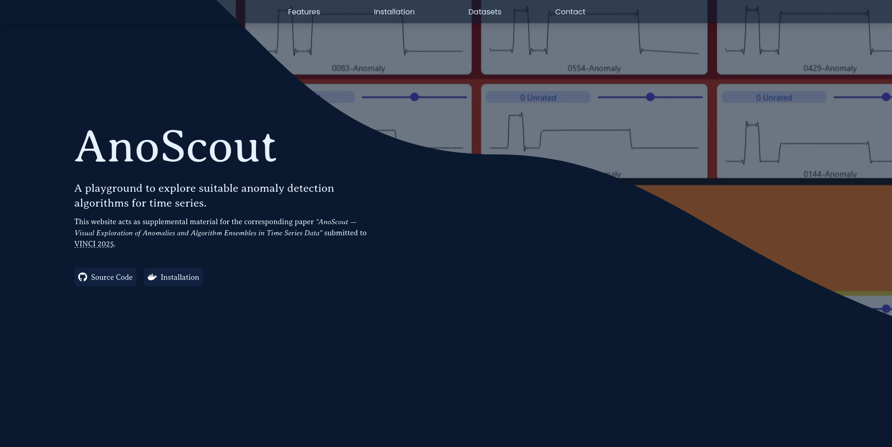

<table align="center"><tr><td align="center" width="9999">

# AnoScout

[anoscout.cgv.tugraz.at](anoscout.cgv.tugraz.at)

</td></tr></table>

AnoScout is an interactive system designed for the visual exploration of anomalies in time-oriented data, offering the following features:
* **Algorithm Ensemble Exploration**: Combine and compare multiple anomaly detection algorithms to capture diverse anomaly types, with visual insights into each algorithm's contribution.
* **Flexible Algorithm Configuration**: Create customized algorithm repertoires by adjusting parameters and using multiple instances of the same method to compare algorithms.
* **Semi-Supervised Labeling Support**: Easily define normal behavior within time series using intuitive projection-based visualizations, enabling both unsupervised and semi-supervised anomaly detection.
* **Visual Anomaly Scoring and Inspection**: Explore anomalies within time series through ensemble-based scoring, interactive line charts, and detailed decomposition of algorithm ensembles.
* **Anomaly Clustering and Taxonomy Discovery**: Group similar anomalies using clustering methods to reveal the structure and types of anomalies across your dataset.
* **Anomaly Recommender System**: Quickly find and prioritize relevant anomalies with a user-driven recommender that adapts to your ratings.
* **Scalable Overview and Detail Navigation**: Effortlessly navigate large datasets with "overview first, zoom and filter, then details on demand" principles for efficient anomaly exploration.

## Setup
AnoScout is a web application designed to run locally, ensuring that your data will never be stored in the cloud. Due to its complex architecture, we provide a Docker setup that can be run on any common operating system capable of running Docker. Below, we provide step-by-step instructions on getting AnoScout running:
1. Windows and Mac: Install [Docker Desktop](https://docs.docker.com/desktop/), Linux: Install [Docker Engine](https://docs.docker.com/engine/install/)
2. Clone this repository.
3. Open a terminal (PowerShell on Windows) within the AnoScout source code folder.
4. Execute the command `docker compose up`  
  _We kindly ask for your patience as the initial setup might take a few minutes._
5. Your local AnoScout instance is available at [http://localhost:5000](http://localhost:5000).

### Manual Setup

In case you do not want to use docker, we provide a manual installation procedure below. First, ensure that the following prerequisites are met:

* [**MongoDB**](https://www.mongodb.com/)
* [**Redis**](https://redis.io/docs/latest/get-started/): Only available directly on Linux, Windows & Mac users need to use a [Docker container](https://redis.io/docs/latest/operate/oss_and_stack/install/install-stack/docker/).
* [**NodeJS**](https://nodejs.org/en): Required to build the frontend.
* [**Python 3.12**](https://www.python.org/): Required to run the backend. 
* [**Poetry**](https://python-poetry.org/): Used to manage the Python dependencies within this project.

Next, follow the subsequent steps to install AnoScout:

1. Start MongoDB and Redis, such that these services are running in the background.
2. Clone this repository and open a terminal or PowerShell within the project folder.
3. Switch to `./frontend` and run `npm i` followed by `npm run build`.
4. Switch back to the project root folder.
5. Install the Python packages via `poetry install --no-root`.
6. Initialize the database via `poetry run python3 backend/initialize_database.py` (Replace `python3` with `py` if on Windows).
7. Start the scheduler via `poetry run python3 backend/anomaly_detection/scheduler.py` (Replace `python3` with `py` if on Windows).
8. Open a new terminal window / PowerShell instance within the same folder.
9. Start AnoScout via `poetry run python3 backend/main.py` (Replace `python3` with `py` if on Windows).
10. Your local AnoScout instance is available at [http://localhost:5000](http://localhost:5000).

## Datasets

We provide several datasets to test AnoScout.

### EEG Dataset

We recorded a simple EEG measurement to observe two common anomalies: Clenching and blinking. These are divided into three CSV files, located in the [dataset/EEG](dataset/EEG) folder. This dataset is ideally used with unsupervised algorithms (bucket type "Scoring").

### Wafer

The Wafer dataset provides several cyclic time series, which have been obtained from semiconductor fabrication processes. The dataset is available in the [UCR Archive](https://www.cs.ucr.edu/%7Eeamonn/time_series_data_2018/) and was originally introduces in the [thesis by Olszewski](https://www.cs.cmu.edu/~bobski/pubs/tr01108-twosided.pdf). In the folder [dataset/Wafer](dataset/Wafer) we provide a subset of the dataset together with a Python script to import it into AnoScout (**only possible with manual non-Docker setup**). This dataset is ideally used with semi-supervised algorithms (bucket type "Classification").

### GutenTAG

[GutenTAG](https://github.com/TimeEval/GutenTAG) is a synthetic data generation tool by Phillip Wenig and Sebastian Schmidl for anomalies in time series data.
The script [gutenTAG_dirichlet_sine.py](dataset/GutenTAG/gutenTAG_dirichlet_sine.py) loads 200 random time series with random anomalies into AnoScout upon execution (**only possible with manual non-Docker setup**). If AnoScout has been installed through the Docker installation, we provide several pre-generated CSV files, which can be manually uploaded. This dataset is ideally used with unsupervised algorithms (bucket type "Scoring").
